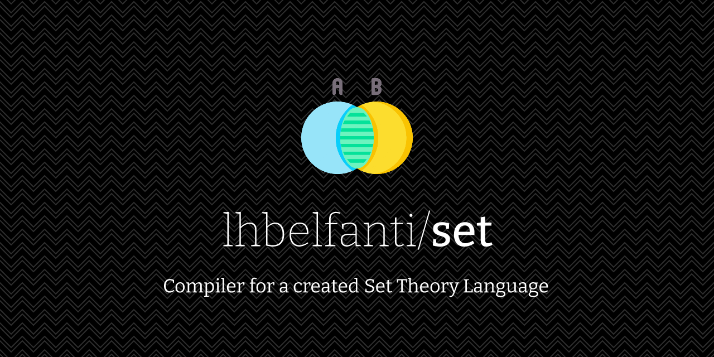

<div align="center">
  <picture>
    <source media="(prefers-color-scheme: dark)" srcset="media/set-dark.png">
    <source media="(prefers-color-scheme: light)" srcset="media/set-light.png">
    
  </picture>

  <br />

  
  
</div>

## Language definitions

### Variables 
	- Definition: 'var a' 		(only lowercase)
	- Assignation: 'var a = 4'	(assign 4 to a)

### Operations
	- set()
		- set({1,2,3,4})		(<b>Returns</b> a set with 4 elements)
		- set([1,10])			(<b>Returns</b> a set with 10 elements, from 1 to 10)
		- set([1,10,2])			(<b>Returns</b> a set from 1 to 10 with a jump of 2: 1,3,5,7,9)
	- print()
		- print(a) 				(Print the value of a)
		- print(s) 				(Print the set s)
		- print('hi') 			(Print the string 'hi'. String concatenation is not allowed)
	- int()
		- int(a,b)				(<b>Returns</b> the intersection between a and b)
	- uni()
		- uni(a,b)				(<b>Returns</b> the union between a and b)
	- len()
		- len(a)				(<b>Returns</b> the quantity of elements of a)
	- avg()
		- avg(a)				(<b>Returns</b> the average of all the elements of a)
	- max()
		- max(a)				(<b>Returns</b> the maximun element of a)
	- min()
		- min(a)				(<b>Returns</b> the the minimun element of a)
	- ext()
		- ext(a,b)				(Extracts all the elements of a from b, and <b>returns</b> it)	
	- add()
		- add(a,5)				(Adds the element 5 to a)
	- del()
		- del(a,5)				(Removes the element 5 from a)
<br/>

## Installing ANTLR4 for python

First, download the ANTLR complete JAR from [the ANTLR site][antlr].

[antlr]:http://www.antlr.org/

Next, install the ANTLR4 Python 2 runtime:

```
pip install antlr4-python2-runtime
```

Then, run ANTLR to compile the grammar and generate Python. Finally, run
the Python main and enter some text.

### Input

For example, in the `grammarTest` directory:

```
$ java -Xmx500M -cp <path to ANTLR complete JAR> org.antlr.v4.Tool -Dlanguage=Python2 Grammar.g4
$ python GrammarTest.py
set({1,2,3,4}
^D
```

Following ANTLR guide, the "<path to ANTLR complete JAR>" should be:

```
/usr/local/lib/antlr-4.7-complete.jar
```

In the example:
```
set({1,2,3,4}
```

is the grammar we want to validate.


### Output

If the grammar is OK the output is:
```
Start
Finish
```

If not, the output is:
```
line ?:? token recognition error at: '?'
Start
Finish
```

---
## License

[MIT](https://choosealicense.com/licenses/mit/)